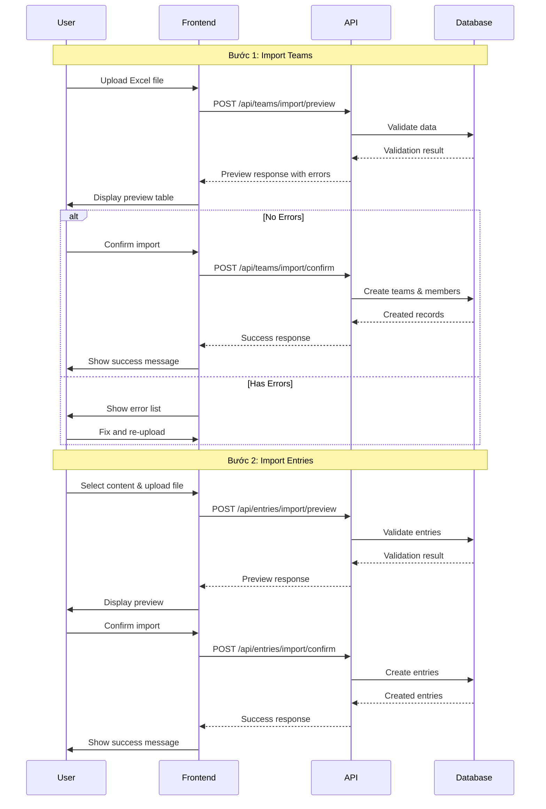

# 📘 Hướng dẫn Đăng Ký Tham Gia Giải Đấu

Tài liệu này hướng dẫn chi tiết về quy trình đăng ký đoàn thể thao tham gia giải đấu sử dụng tính năng import Excel.

---

## **Mục Lục**

1. [Tổng Quan](#tổng-quan)
2. [Bước 1: Đăng Ký Danh Sách Đội](#bước-1-đăng-ký-danh-sách-đội)
3. [Bước 2: Đăng Ký Nội Dung Thi Đấu](#bước-2-đăng-ký-nội-dung-thi-đấu)
4. [Flow Hoạt Động](#flow-hoạt-động)
5. [Xử Lý Lỗi](#xử-lý-lỗi)
6. [FAQ](#faq)

---

## **Tổng Quan**

### **Quy Trình Đăng Ký**

Quy trình đăng ký gồm 2 bước chính:

```
Bước 1: Đăng ký danh sách đội
   ↓
Bước 2: Đăng ký nội dung thi đấu
```

### **Vị Trí Truy Cập**

- **Route**: `/tournament-manager`
- **Tab**: "Quản lý đoàn đăng ký" (Delegation Management)
- **Vai trò**: Tournament Manager

---

## **Bước 1: Đăng Ký Danh Sách Đội**

### **1.1 Tải File Mẫu**

Nhấn nút **"Tải file mẫu đăng ký danh sách"** để download file `DangKyDanhSach.xlsx`

### **1.2 Cấu Trúc File Excel**

File Excel chứa danh sách các đội và thành viên với cấu trúc:

| Team Name  | Description | Member Name  | Email       | Role         |
| ---------- | ----------- | ------------ | ----------- | ------------ |
| Team Alpha | Elite team  | Nguyen Van A | a@email.com | team_manager |
| Team Alpha | Elite team  | Tran Thi B   | b@email.com | athlete      |
| Team Beta  | Young team  | Le Van C     | c@email.com | team_manager |

**Các trường:**

- `Team Name` (Bắt buộc): Tên đội (tối đa 100 ký tự)
- `Description` (Tùy chọn): Mô tả về đội
- `Member Name` (Bắt buộc): Tên thành viên
- `Email` (Bắt buộc): Email thành viên (duy nhất)
- `Role` (Bắt buộc): Vai trò (`team_manager`, `coach`, `athlete`)

**Lưu ý:**

- Mỗi đội phải có ít nhất **1 team_manager**
- Một thành viên có thể tham gia nhiều đội với vai trò khác nhau
- Email phải là duy nhất trong hệ thống

### **1.3 Import File**

1. Nhấn nút **"Import danh sách đội"**
2. Dialog mở ra với giao diện upload file
3. Kéo thả hoặc click để chọn file Excel
4. Nhấn **"Xem trước"**

### **1.4 Preview & Validation**

Sau khi nhấn "Xem trước", hệ thống sẽ:

✅ **Validate dữ liệu:**

- Kiểm tra định dạng file
- Kiểm tra các trường bắt buộc
- Kiểm tra email hợp lệ
- Kiểm tra vai trò hợp lệ

📊 **Hiển thị preview:**

- Bảng danh sách các đội và thành viên
- Highlight các dòng có lỗi (màu đỏ)
- Danh sách chi tiết các lỗi cần sửa

### **1.5 Confirm Import**

Nếu **KHÔNG CÓ LỖI**, nút **"Xác nhận Import"** sẽ được kích hoạt.

Nhấn nút để hoàn tất import:

- Tạo các đội mới
- Thêm thành viên vào đội
- Hiển thị thông báo thành công

---

## **Bước 2: Đăng Ký Nội Dung Thi Đấu**

### **2.1 Chọn Nội Dung Thi Đấu**

Sau khi hoàn tất bước 1, chuyển sang **"Bước 2: Đăng ký nội dung thi đấu"**

Chọn một nội dung thi đấu từ dropdown list.

### **2.2 Loại Nội Dung Thi Đấu**

Hệ thống hỗ trợ 3 loại nội dung:

#### **Single (Đơn)**

- File mẫu: `DangKyNoiDungThiDau_Single.xlsx`
- Cấu trúc:
  | Name | Email |
  |------|-------|
  | Nguyen Van A | a@email.com |

#### **Double (Đôi)**

- File mẫu: `DangKyNoiDungThiDau_Double.xlsx`
- Cấu trúc:
  | Player 1 Name | Player 1 Email | Player 2 Name | Player 2 Email |
  |---------------|----------------|---------------|----------------|
  | Nguyen Van A | a@email.com | Tran Thi B | b@email.com |

#### **Team (Đội)**

- File mẫu: `DangKyNoiDungThiDau_Team.xlsx`
- Cấu trúc:
  | Team Name | Member Name | Email |
  |-----------|-------------|-------|
  | Team Alpha | Nguyen Van A | a@email.com |
  | Team Alpha | Tran Thi B | b@email.com |

### **2.3 Import File**

Quy trình tương tự bước 1:

1. Tải file mẫu tương ứng
2. Điền thông tin vận động viên
3. Import và xem preview
4. Xác nhận import

**Lưu ý:**

- Email phải khớp với thành viên đã đăng ký ở bước 1
- Số lượng thành viên phải phù hợp với loại nội dung:
  - Single: 1 người
  - Double: 2 người
  - Team: Theo quy định giải đấu

---

## **Flow Hoạt Động**

### **API Flow**



### **Component Structure**

```
DelegationManagement (Page)
├── Tournament Selection Dropdown
├── Step Navigation (Teams | Entries)
│
├── Step 1: Team Registration
│   ├── Download Template Button
│   ├── Import Button → TeamImportDialog
│   └── Instructions
│
└── Step 2: Entry Registration
    ├── Content Selection Dropdown
    ├── Download Template Button (dynamic)
    ├── Import Button → EntryImportDialog
    └── Instructions

TeamImportDialog
├── ExcelFileUpload Component
├── Preview Step
│   └── ImportPreview Component
└── Confirm Button

EntryImportDialog
├── ExcelFileUpload Component
├── Preview Step (content type specific)
│   └── ImportPreview Component
└── Confirm Button
```

---

## **Xử Lý Lỗi**

### **Lỗi Thường Gặp**

#### **1. File không đúng định dạng**

```
❌ Error: "File phải có định dạng .xlsx hoặc .xls"
✅ Solution: Đảm bảo file là Excel format (.xlsx/.xls)
```

#### **2. Thiếu trường bắt buộc**

```
❌ Error: "Dòng 5 - Team Name: Trường này là bắt buộc"
✅ Solution: Điền đầy đủ các trường bắt buộc
```

#### **3. Email không hợp lệ**

```
❌ Error: "Dòng 10 - Email: Email không hợp lệ"
✅ Solution: Kiểm tra định dạng email (example@domain.com)
```

#### **4. Vai trò không hợp lệ**

```
❌ Error: "Dòng 8 - Role: Vai trò phải là team_manager, coach hoặc athlete"
✅ Solution: Sử dụng đúng giá trị role
```

#### **5. Thiếu team manager**

```
❌ Error: "Team Alpha phải có ít nhất 1 team_manager"
✅ Solution: Thêm ít nhất 1 thành viên với role = team_manager
```

#### **6. Email không tồn tại (Entry Import)**

```
❌ Error: "Dòng 3 - Email: User với email này chưa được đăng ký"
✅ Solution: Đảm bảo email đã được đăng ký ở bước 1
```

### **Error Display**

Hệ thống hiển thị lỗi với:

- **Alert banner**: Tổng số lỗi và dòng bị lỗi
- **Error list**: Chi tiết từng lỗi (dòng, trường, message)
- **Table highlight**: Dòng có lỗi được highlight màu đỏ
- **Status badge**: Badge "Lỗi" hoặc "Hợp lệ" cho mỗi dòng

---

## **FAQ**

### **Q: Có thể import nhiều đội cùng lúc không?**

A: Có, file Excel có thể chứa nhiều đội và thành viên. Hệ thống sẽ tự động group theo tên đội.

### **Q: Một người có thể tham gia nhiều đội không?**

A: Có, cùng một email có thể xuất hiện trong nhiều đội với vai trò khác nhau.

### **Q: Có giới hạn số lượng thành viên trong file không?**

A: Không có giới hạn cứng, nhưng nên giữ dưới 1000 dòng để đảm bảo hiệu suất.

### **Q: Sau khi import xong có thể sửa đổi không?**

A: Có, bạn có thể sửa đổi thông tin đội và thành viên sau khi import thành công.

### **Q: File Excel có thể chứa công thức không?**

A: Có, nhưng hệ thống chỉ đọc giá trị đã tính toán, không thực thi công thức.

### **Q: Có thể import file CSV không?**

A: Hiện tại chỉ hỗ trợ .xlsx và .xls. Bạn có thể convert CSV sang Excel trước khi import.

### **Q: Preview có giới hạn số dòng hiển thị không?**

A: Có, preview hiển thị tối đa 100 dòng đầu tiên. Tuy nhiên, validation vẫn chạy cho toàn bộ file.

### **Q: Có thể import nội dung thi đấu trước khi import đội không?**

A: Không, bạn phải import đội trước (bước 1) để hệ thống có thông tin thành viên.

### **Q: Email có phân biệt chữ hoa chữ thường không?**

A: Không, email không phân biệt chữ hoa/thường (case-insensitive).

### **Q: Có thể hủy import sau khi đã xác nhận không?**

A: Không, sau khi xác nhận import, dữ liệu đã được lưu vào database. Bạn cần xóa thủ công nếu muốn hủy.

---

## **Best Practices**

1. **Kiểm tra dữ liệu trước khi import:**
   - Review file Excel kỹ trước khi upload
   - Sử dụng chức năng preview để phát hiện lỗi sớm

2. **Backup dữ liệu:**
   - Giữ bản copy file Excel gốc
   - Export dữ liệu hiện tại trước khi import mới

3. **Import từng phần:**
   - Với dữ liệu lớn, chia nhỏ thành nhiều file
   - Import và kiểm tra từng phần

4. **Validate email:**
   - Đảm bảo email chính xác trước khi import
   - Sử dụng email thật để gửi thông báo sau này

5. **Đặt tên đội rõ ràng:**
   - Sử dụng tên đội dễ nhận diện
   - Tránh trùng lặp tên đội

---

## **Technical Details**

### **Services Used**

- `teamService.previewImportTeams(file)` - Preview teams import
- `teamService.confirmImportTeams(data)` - Confirm teams import
- `entryService.previewImportSingleEntries(file, contentId)` - Preview single entries
- `entryService.confirmImportSingleEntries(data)` - Confirm single entries
- `entryService.previewImportDoubleEntries(file, contentId)` - Preview double entries
- `entryService.confirmImportDoubleEntries(data)` - Confirm double entries
- `entryService.previewImportTeamEntries(file, contentId)` - Preview team entries
- `entryService.confirmImportTeamEntries(data)` - Confirm team entries

### **File Locations**

- **Excel Templates**: `src/assets/`
  - `DangKyDanhSach.xlsx`
  - `DangKyNoiDungThiDau_Single.xlsx`
  - `DangKyNoiDungThiDau_Double.xlsx`
  - `DangKyNoiDungThiDau_Team.xlsx`

- **Components**:
  - `src/pages/TournamentManager/DelegationManagement/DelegationManagement.tsx`
  - `src/components/custom/TeamImportDialog.tsx`
  - `src/components/custom/EntryImportDialog.tsx`
  - `src/components/custom/ImportPreview.tsx`
  - `src/components/custom/ExcelFileUpload.tsx`

### **Type Definitions**

- `src/types/team.types.ts` - Team and TeamMember types
- `src/types/entry.types.ts` - Entry types (Single/Double/Team)

---

## **Support**

Nếu gặp vấn đề, vui lòng:

1. Kiểm tra file Excel theo đúng format mẫu
2. Xem lại hướng dẫn ở section [Xử Lý Lỗi](#xử-lý-lỗi)
3. Liên hệ support với thông tin:
   - Screenshot màn hình lỗi
   - File Excel gặp vấn đề
   - Thông tin giải đấu đang import

---

**Phiên bản**: 1.0.0  
**Cập nhật lần cuối**: 20/01/2026
